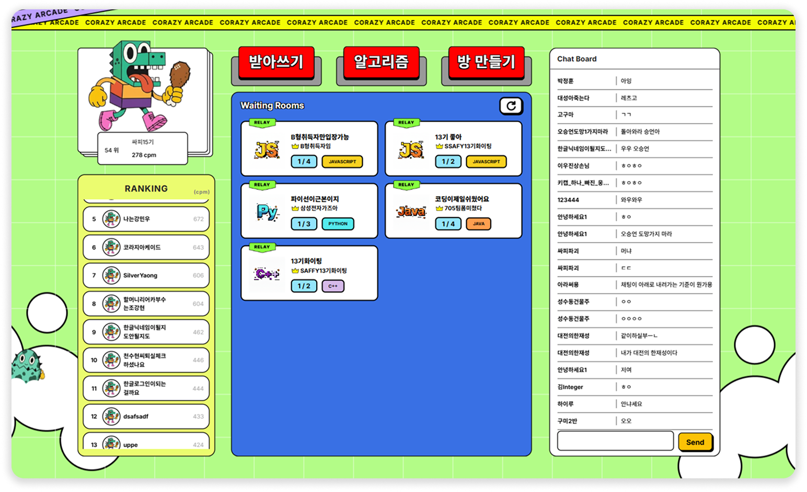

# COrazy Arcade


> 알고리즘 코드를 타이핑하고, 팀원과 릴레이로 풀어내는 코딩 게임 플랫폼

**프로젝트 기간**: 2025.10 - 2025.11 (6주) · **팀 구성**: 6인 (Backend 3, Frontend 2, Infra 1)
> 시연영상 [https://youtu.be/NX_4ZbExZ_4?si=uj7CizLvJFMxP4hL]
---

## 담당 역할

**전체 UI/UX 디자인 + 프론트엔드 개발** (프로젝트 기여 비중 약 20%)

| 구분 | 담당 내역 |
|------|----------|
| 디자인 | 전체 서비스 디자인 시스템, 모든 페이지 UI/UX 설계 |
| 메인 로비 | 실시간 랭킹, 방 목록, 전체 채팅, 로그인 플로우 |
| 반아쓰기 모드 | Monaco Editor 커스터마이징, 타이핑 검증 로직, CPM 측정 |
| 릴레이 코딩 | 멀티플레이 UI, 참가자 카드, 턴 표시, 게임 결과 모달 |
| 공통 컴포넌트 | 토스트 시스템, 설정 모달, BGM 플레이어, 코드 에디터 래퍼 |

---

## 기술 스택

### Frontend


| 분류 | 기술 |
|------|------|
| 코드 에디터 | Monaco Editor |
| 실시간 통신 | Socket.io Client, STOMP over SockJS, Native WebSocket |
| 상태 관리 | Zustand + Immer |
| 라우팅 | React Router DOM 7.9.5 |
| 레이아웃 | react-resizable-panels |
| 수식 렌더링 | KaTeX |

### Backend / Infra (협업)
`Spring Boot 3.5` · `Spring Cloud Gateway` · `Node.js` · `FastAPI` · `MySQL` · `Redis` · `RabbitMQ` · `Docker` · `AWS (EC2, RDS, S3)` · `Nginx` · `GitLab CI/CD`

---
## 주요 기능 및 화면 설명
### 1. 메인 화면
- 개인 프로필
- 전체 랭킹
- 릴레이 게임방 목록
- 전체 채팅창

### 2. 릴레이 게임 풀이
- 최대 4명의 친구들과 릴레이로 알고리즘을 협력하여 푸는 기능
#### (1) 다른 친구의 차례일 때는 채팅과 이모티콘,핀 기능을 통해 의견 전달

#### (2) 나의 차례일 때는 채팅창 사용 불가능

#### (3) 문제를 다 풀었다면 제출 & 팀원 간 순위 확인


### 3. 알고리즘 따라쓰기
- 알고리즘에 익숙하지 않는 입문자를 위한 기초 알고리즘을 따라칠 수 있는 기능

---

## 주요 구현 내용

### 1. WebSocket 프로토콜 3종 분리 운용

릴레이 게임(STOMP), 채점 스트리밍(Raw WebSocket), 채팅(Socket.IO)에 서로 다른 프로토콜을 사용했습니다.

> **왜 분리했나**: 릴레이 게임은 `/topic/rooms/{id}` 형태의 토픽 기반 pub/sub이 필요했고, 채점 결과는 100개 테스트케이스를 실시간으로 밀어줘야 해서 오버헤드 없는 Raw WebSocket이 적합했습니다. 채팅은 자동 재연결과 presence 이벤트가 중요해 Socket.IO를 선택했습니다.

```
릴레이 게임 상태 동기화  → STOMP over SockJS  (토픽 구독 방식)
채점 진행률 실시간 수신  → Native WebSocket   (저지연 스트리밍)
로비/방 채팅            → Socket.IO          (자동재연결, 입퇴장 이벤트)
```

---

### 2. Zustand + Immer로 릴레이 게임 상태 중앙화

WebSocket 이벤트(USER_JOINED, TURN_CHANGE, CODE_UPDATE 등)를 하나의 스토어에서 처리합니다.

> **왜 Zustand를 선택했나**: WebSocket 이벤트마다 참가자 목록, 현재 턴, 공유 코드 등 중첩 객체를 동시에 바꿔야 해서 Redux의 불변 업데이트 보일러플레이트가 부담스러웠습니다. Immer 미들웨어를 쓰면 `state.participants[id].isReady = true` 같은 직접 할당이 가능해 이벤트 핸들러 코드가 훨씬 간결해졌습니다.

```js
// handleEvent() 에서 WebSocket 이벤트 → 상태 분기 처리
// 자신의 코드 업데이트는 무시해 로컬 편집 덮어쓰기 방지
if (myUserId !== codeData.userId) set(state => { state.sharedCode = codeData.code })
```

---

### 3. Monaco Editor 커스터마이징 — 반아쓰기 모드

`constrained-editor-plugin`으로 문제 서명 라인을 잠그고, 타이핑한 문자를 줄별로 검증해 색상 피드백을 줍니다.

> **왜 constrained editor를 썼나**: 사용자가 함수 서명이나 완성된 라인을 건드리면 게임이 성립되지 않습니다. Monaco의 기본 편집 제한 API는 세밀한 구간 잠금이 어려워 별도 플러그인을 적용했습니다. 잠금 상태에서도 문법 하이라이팅은 그대로 유지됩니다.

---

### 4. Axios 인터셉터 — 토큰 갱신 큐 패턴

Access Token 만료 시 동시에 여러 요청이 들어와도 refresh를 한 번만 호출합니다.

> **왜 큐 패턴이 필요했나**: 401 응답마다 무조건 refresh를 시도하면, 동시 요청이 5개일 때 refresh가 5번 연쇄 호출되고 토큰이 꼬입니다. 첫 번째 요청만 refresh를 실행하고 나머지는 큐에 대기시킨 뒤 새 토큰으로 일괄 재시도하는 방식으로 해결했습니다.

---

### 5. 오디오 객체 풀링 — 타이핑 효과음

8개의 Audio 인스턴스를 미리 생성하고 순환 재사용합니다.

> **왜 풀링을 썼나**: 타이핑 속도가 빠를 때 keystroke마다 `new Audio()`를 생성하면 GC 부하로 프레임이 끊깁니다. 인스턴스를 재사용하면 메모리 할당 없이 `.currentTime = 0; .play()`만 호출하면 돼 반응성이 유지됩니다.

---

### 6. 분할 화면(Split Panel) + 문제 렌더링

`react-resizable-panels`로 문제 설명 / 에디터 / 실행 결과 영역을 드래그로 조절할 수 있고, KaTeX로 알고리즘 수식을 렌더링합니다.

> **왜 resizable panel을 썼나**: 코딩 문제를 풀 때 화면 비율 선호가 개인마다 달라서 고정 레이아웃은 불편합니다. 드래그로 자유롭게 조절하면 문제를 넓게 보거나 에디터를 넓게 쓸 수 있습니다.

---

### 7. Google OAuth 2단계 인증 플로우

신규 사용자는 `sessionToken`을 거쳐 닉네임 입력 후 JWT를 발급받고, 기존 사용자는 코드 교환만으로 바로 로그인합니다.

> **왜 sessionToken을 중간에 쓰나**: Google 인가 코드를 바로 JWT로 교환하면 코드 재사용 공격에 취약합니다. 서버가 단일 사용 가능한 sessionToken을 발급해 닉네임 입력 단계에서 소진시키는 방식으로 크리덴셜 스터핑을 차단합니다.

---

## 실행 방법

### 사전 요구사항

- Node.js 20.x
- Java 21
- Python 3.x
- Docker & Docker Compose
- MySQL 8.x, Redis 7.x

### 환경 변수 설정

각 서버 디렉토리의 `.env.example`을 복사해 `.env`를 만들고 값을 채웁니다.

```bash
cp .env.example .env
```

자세한 환경 변수 목록은 [포팅 매뉴얼](exec/README.md)을 참고하세요.

### 프론트엔드

```bash
cd frontend/frontend
npm install
npm run dev
# http://localhost:5173
```

### 백엔드 (Docker)

```bash
# 예: Auth Server
cd backend/auth-server/coa-main-server
docker build -t coa-auth:latest .
docker run -d -p 8080:8080 --env-file .env coa-auth:latest
```

### 메시지 큐 (RabbitMQ + Redis)

```bash
cd infra/message-setting/message-queue-setting
docker compose up -d
```

---

## 시스템 아키텍처

```
[React Client]
      │
      ▼
[API Gateway (Spring Cloud Gateway :8080)]
      │
      ├──▶ Auth Server     — JWT, Google OAuth2
      ├──▶ Chat Server     — Socket.IO 실시간 채팅
      ├──▶ Snippet Server  — 알고리즘 문제/템플릿 관리
      └──▶ Compile Server  — 코드 채점 요청 (FastAPI)
                │
           [RabbitMQ]
                │
                ▼
         Compile Worker   — Docker 샌드박스 실행 · 채점
                │
               [S3] — 테스트케이스 저장
```

---

## 프로젝트 구조

```
corazy_arcade/
├── backend/
│   ├── auth-server/       # Spring Boot — 인증/인가, OAuth2, JWT
│   ├── gateway-server/    # Spring Cloud Gateway — 라우팅
│   ├── chat-server/       # Node.js + Socket.IO — 실시간 채팅
│   ├── snippet-server/    # Spring Boot + JPA — 문제 관리
│   ├── compile-server/    # FastAPI — 채점 요청 오케스트레이션
│   └── compile-worker/    # Node.js — Docker 샌드박스 채점
├── frontend/
│   └── frontend/          # React + Vite 클라이언트
├── infra/                 # RabbitMQ + Redis Docker Compose
└── exec/                  # 포팅 매뉴얼, 시연 자료
```
