# COrazy Arcade 포팅 매뉴얼

## 목차

1. [GitLab 소스 클론 이후 빌드 및 배포할 수 있도록 정리한 문서](#1-gitlab-소스-클론-이후-빌드-및-배포할-수-있도록-정리한-문서)
2. [프로젝트에서 사용하는 외부 서비스 정보를 정리한 문서](#2-프로젝트에서-사용하는-외부-서비스-정보를-정리한-문서)
3. [DB 덤프 파일 최신본](#3-db-덤프-파일-최신본)
4. [시연 시나리오](#4-시연-시나리오)

---
### 1.1 사용한 JVM, 웹서버, WAS 제품 등의 종류와 설정 값, 버전(IDE 버전 포함) 기재

#### Backend 서버들 (Spring Boot)

- **JVM**: OpenJDK 21 (Bellsoft Liberica JRE Alpine)
- **WAS**: Spring Boot 3.4.x ~ 3.5.x (내장 Tomcat)
- **빌드 도구**: Gradle 8.5
- **IDE**: IntelliJ IDEA (권장)

**서버 목록 및 기술 스택:**

| 서버명         | 디렉토리                            | 주요 기술                                       | 포트 | 설명                  |
| -------------- | ----------------------------------- | ----------------------------------------------- | ---- | --------------------- |
| Gateway Server | `gateway-server/coa-main-server`    | Spring Boot 3.5.6, Spring Cloud Gateway         | 8080 | API Gateway 및 라우팅 |
| Auth Server    | `auth-server/coa-main-server`       | Spring Boot 3.5.6, Spring Security, OAuth2, JWT | 8080 | 인증/인가 서버        |
| Relay Server   | `relay-server/coa-relay-server`     | Spring Boot 3.4.11, WebSocket, Redis, Redisson  | 8080 | 게임 릴레이 서버      |
| Chat Server    | `chat-server/coa-chat-server`       | Spring Boot, WebSocket, STOMP                   | 8080 | 채팅 서버             |
| Ranking Server | `ranking-server/coa-ranking-server` | Spring Boot, JPA                                | 8080 | 랭킹 관리 서버        |
| Snippet Server | `snippet-server/coa-snippet-server` | Spring Boot, JPA                                | 8080 | 코드 스니펫 관리      |

**공통 의존성:**

- Spring Data JPA
- MySQL Connector
- Lombok
- Spring Validation
- Spring Dotenv (환경변수 관리)

#### Compile Server (FastAPI)

- **Runtime**: Python 3.x
- **웹 프레임워크**: FastAPI
- **패키지 매니저**: pip / uv
- **주요 라이브러리**:
  - fastapi (고성능 웹 프레임워크)
  - uvicorn (ASGI 서버)
  - docker (Docker SDK for Python)
  - aio-pika (RabbitMQ 비동기 클라이언트)
  - redis (캐싱 및 Pub/Sub)
  - boto3 (AWS S3 연동)
  - databases, aiomysql (MySQL 비동기 연결)

**디렉토리**: `compile-server/coa-compile-server`

#### Compile Worker (Node.js)

- **Runtime**: Node.js 20.x
- **패키지 매니저**: npm
- **주요 라이브러리**:
  - dockerode (Docker 컨테이너 관리)
  - amqplib (RabbitMQ 메시지 큐)
  - redis (캐싱 및 세션 관리)
  - aws-sdk (S3 연동)

**디렉토리**: `compile-worker/coa-compile-worker`

#### Frontend (React + Vite)

- **Runtime**: Node.js 20.x
- **웹서버**: Nginx (Alpine)
- **프레임워크**: React 19.1.1
- **빌드 도구**: Vite 7.1.7
- **주요 라이브러리**:
  - React Router DOM 7.9.5
  - Zustand 5.0.2 (상태 관리)
  - Socket.io Client 4.8.1
  - @stomp/stompjs 7.2.1
  - Phaser 3.90.0 (게임 엔진)
  - Monaco Editor (코드 에디터)
  - TailwindCSS 4.1.16

**디렉토리**: `frontend/frontend`

#### 인프라

- **컨테이너**: Docker
- **오케스트레이션**: Kubernetes
- **CI/CD**: GitLab CI/CD
- **이미지 레지스트리**: Docker Hub
- **빌드 도구**: Kaniko

---

### 1.2 빌드 시 사용되는 환경 변수 등의 내용 상세 기재

#### Backend 서버 공통 환경변수 (.env 파일)

각 Spring Boot 서버 디렉토리에 `.env` 파일 필요:

```env
# MySQL Database Configuration
DB_HOST=your-db-host
DB_PORT=3306
DB_NAME=your-db-name
DB_USERNAME=your-db-username
DB_PASSWORD=your-db-password

# Server Configuration
SERVER_PORT=8080

# Redis Configuration
REDIS_HOST=your-redis-host
REDIS_PORT=6379
REDIS_DB=0

# JWT Configuration (Auth Server)
JWT_ACCESS_TOKEN_VALIDITY=3600000
JWT_REFRESH_TOKEN_VALIDITY=604800000
JWT_SECRET=your-jwt-secret-key-minimum-32-characters

# Google OAuth (Auth Server)
GOOGLE_CLIENT_ID=your-google-client-id
GOOGLE_CLIENT_SECRET=your-google-client-secret
GOOGLE_REDIRECT_URI=https://your-domain/auth/google/callback

# CORS Configuration
CORS_ALLOWED_ORIGINS=https://your-domain
```

#### Compile Server 환경변수 (.env 파일)

```env
# Database 설정
DB_HOST=your-db-host
DB_PORT=3306
DB_NAME=your-db-name
DB_USERNAME=your-db-username
DB_PASSWORD=your-db-password

# RabbitMQ 설정
RABBITMQ_HOST=your-rabbitmq-host
RABBITMQ_PORT=5672
RABBITMQ_USERNAME=your-rabbitmq-username
RABBITMQ_PASSWORD=your-rabbitmq-password

# Redis 설정
REDIS_HOST=your-redis-host
REDIS_PORT=6379
REDIS_PASSWORD=your-redis-password

# AWS S3 설정
AWS_ACCESS_KEY_ID=your-aws-access-key
AWS_SECRET_ACCESS_KEY=your-aws-secret-key
AWS_REGION=ap-northeast-2
AWS_S3_BUCKET=your-s3-bucket-name

# CORS 설정
ALLOWED_ORIGINS=https://your-domain
```

#### Compile Worker 환경변수 (.env 파일)

```env
# RabbitMQ 설정
RABBITMQ_HOST=<RabbitMQ 호스트>
RABBITMQ_PORT=5672
RABBITMQ_USERNAME=<RabbitMQ 사용자명>
RABBITMQ_PASSWORD=<RabbitMQ 비밀번호>
RABBITMQ_QUEUE_NAME=compile_queue

# Redis 설정
REDIS_HOST=<Redis 호스트>
REDIS_PORT=6379
REDIS_PASSWORD=<Redis 비밀번호>

# AWS S3 설정 (선택사항)
AWS_ACCESS_KEY_ID=<AWS Access Key>
AWS_SECRET_ACCESS_KEY=<AWS Secret Key>
AWS_REGION=<AWS Region>
AWS_S3_BUCKET=<S3 Bucket 이름>

# Docker 설정
DOCKER_SOCKET=/var/run/docker.sock

# Worker 설정
MAX_CONCURRENT_JOBS=5
EXECUTION_TIMEOUT=30000
```

#### Frontend 환경변수 (.env 파일)

`frontend/frontend/.env`:

```env
# API 엔드포인트
VITE_API_BASE_URL=https://your-domain.com
VITE_WS_URL=wss://your-domain.com

# OAuth 설정
VITE_GOOGLE_CLIENT_ID=your-google-client-id

# 기타 설정
VITE_APP_NAME=COrazy Arcade
```

---

### 1.3 배포 시 특이사항 기재

#### Docker 기반 배포

**1. Backend 서버 빌드 및 실행 (예: Auth Server)**

```bash
cd auth-server/coa-main-server

# .env 파일 생성 (환경변수 설정)
vim .env

# Docker 이미지 빌드
docker build -t coa-auth:latest .

# 컨테이너 실행
docker run -d \
  --name coa-auth \
  -p 8080:8080 \
  --env-file .env \
  coa-auth:latest
```

**2. Frontend 빌드 및 실행**

```bash
cd frontend/frontend

# .env 파일 생성
vim .env

# Docker 이미지 빌드
docker build -t coa-frontend:latest .

# 컨테이너 실행
docker run -d \
  --name coa-frontend \
  -p 80:80 \
  coa-frontend:latest
```

**3. Compile Server 빌드 및 실행**

```bash
cd compile-server/coa-compile-server

# .env 파일 생성
vim .env

# Docker 이미지 빌드
docker build -t coa-compile:latest .

# 컨테이너 실행 (Docker-in-Docker 필요)
docker run -d \
  --name coa-compile-server \
  -v /var/run/docker.sock:/var/run/docker.sock \
  --env-file .env \
  -p 8000:8000 \
  coa-compile:latest
```

#### Kubernetes 배포

GitLab CI/CD를 통한 자동 배포:

1. **이미지 빌드**: Kaniko를 사용하여 Docker 이미지 빌드 및 Docker Hub에 푸시
2. **배포**: kubectl을 사용하여 Kubernetes Deployment 재시작

```yaml
# .gitlab-ci.yml 예시
stages:
  - build
  - deploy

build:
  stage: build
  image: gcr.io/kaniko-project/executor:debug
  script:
    - /kaniko/executor --context . --dockerfile Dockerfile --destination <이미지명>:latest

deploy:
  stage: deploy
  image: dtzar/helm-kubectl:latest
  script:
    - kubectl rollout restart deployment/<deployment-name>
```

#### 특이사항

1. **Docker Socket 마운트**: Compile Server와 Worker는 Docker 컨테이너를 관리하므로 Docker Socket을 마운트해야 합니다.

   ```bash
   -v /var/run/docker.sock:/var/run/docker.sock
   ```

2. **메모리 최적화**: Frontend 빌드 시 Node.js 메모리 제한 설정:

   ```bash
   NODE_OPTIONS="--max-old-space-size=2048"
   ```

3. **Multi-stage Build**: 모든 Dockerfile은 Multi-stage build를 사용하여 최종 이미지 크기 최소화

4. **Health Check**: Kubernetes 배포 시 각 서비스의 Health Check 엔드포인트 확인 필요

5. **데이터베이스 마이그레이션**: 최초 배포 시 DB 스키마 및 초기 데이터 설정 필요

---

### 1.4 DB 접속 정보 등 프로젝트(ERD)에 활용되는 주요 계정 및 프로퍼티가 정의된 파일 목록

#### 데이터베이스 접속 정보

각 Backend 서버의 `application.yml` 또는 `application.properties` 파일에서 관리:

**위치 예시**:

- `auth-server/coa-main-server/src/main/resources/application.yml`
- `gateway-server/coa-main-server/src/main/resources/application.yml`
- `relay-server/coa-relay-server/src/main/resources/application.yml`

**설정 예시** (application.yml):

```yaml
spring:
  datasource:
    url: jdbc:mysql://${DB_HOST}:${DB_PORT}/${DB_NAME}?useSSL=false&serverTimezone=UTC&allowPublicKeyRetrieval=true
    username: ${DB_USERNAME}
    password: ${DB_PASSWORD}
    driver-class-name: com.mysql.cj.jdbc.Driver

  jpa:
    hibernate:
      ddl-auto: validate # 프로덕션: validate, 개발: update
    show-sql: false
    properties:
      hibernate:
        format_sql: true
        dialect: org.hibernate.dialect.MySQL8Dialect

  redis:
    host: ${REDIS_HOST}
    port: ${REDIS_PORT}
    password: ${REDIS_PASSWORD}

jwt:
  secret: ${JWT_SECRET}
  expiration: ${JWT_EXPIRATION}

cors:
  allowed-origins: ${CORS_ALLOWED_ORIGINS}
```

#### 주요 프로퍼티 파일 목록

| 서버           | 프로퍼티 파일 위치                                                     |
| -------------- | ---------------------------------------------------------------------- |
| Auth Server    | `auth-server/coa-main-server/src/main/resources/application.yml`       |
| Gateway Server | `gateway-server/coa-main-server/src/main/resources/application.yml`    |
| Relay Server   | `relay-server/coa-relay-server/src/main/resources/application.yml`     |
| Chat Server    | `chat-server/coa-chat-server/src/main/resources/application.yml`       |
| Ranking Server | `ranking-server/coa-ranking-server/src/main/resources/application.yml` |
| Snippet Server | `snippet-server/coa-snippet-server/src/main/resources/application.yml` |
| Compile Server | `compile-server/coa-compile-server/.env`                               |
| Compile Worker | `compile-worker/coa-compile-worker/.env`                               |
| Frontend       | `frontend/frontend/.env`                                               |

**주의**: `.env` 파일과 실제 계정 정보는 보안상 Git에 포함되지 않습니다. 배포 시 별도로 생성 필요합니다.

---

## 2. 프로젝트에서 사용하는 외부 서비스 정보를 정리한 문서

### 2.1 소셜 인증 (OAuth2)

#### Google OAuth 2.0

**용도**: 사용자 소셜 로그인

**필요한 정보**:

- Client ID
- Client Secret
- Redirect URI

**설정 위치**:

- Auth Server: `auth-server/coa-main-server/src/main/resources/application.yml`
- Frontend: `frontend/frontend/.env`

**Google Cloud Console 설정**:

1. [Google Cloud Console](https://console.cloud.google.com/) 접속
2. OAuth 동의 화면 구성
3. 승인된 리디렉션 URI 등록: `<도메인>/login/oauth2/code/google`

---

### 2.2 포트 및 클라우드 서비스

#### AWS (Amazon Web Services)

**사용 서비스**:

- **S3 (Simple Storage Service)**: 코드 실행 결과, 파일 저장
- **EC2**: GitLab Runner 호스팅

**필요한 정보**:

- AWS Access Key ID
- AWS Secret Access Key
- AWS Region
- S3 Bucket 이름

**설정 위치**: `compile-server/coa-compile-server/.env`

---

#### Docker Hub

**용도**: Docker 이미지 레지스트리

**계정**: your-dockerhub-username

**이미지 목록**:

- `your-dockerhub-username/coa-auth:latest`
- `your-dockerhub-username/coa-gateway:latest`
- `your-dockerhub-username/coa-relay:latest`
- `your-dockerhub-username/coa-chat:latest`
- `your-dockerhub-username/coa-ranking:latest`
- `your-dockerhub-username/coa-snippet:latest`
- `your-dockerhub-username/coa-compile:latest`
- `your-dockerhub-username/coa-frontend:latest`

---

### 2.3 코드 컴파일 관련 외부 서비스

**Docker**:

- 코드 실행을 위한 샌드박스 환경 제공
- Python, Java, C, C++ 등 다양한 언어 지원

**RabbitMQ**:

- 컴파일 작업 큐 관리
- Compile Server와 Worker 간 메시지 전달

**Redis**:

- 세션 관리
- 캐싱
- Pub/Sub 기능

---

### 2.4 기타 필요한 외부 서비스 정보

#### MySQL

- **버전**: 8.x
- **용도**: 주요 데이터 저장소
- **포트**: 3306

#### Redis

- **버전**: 7.x
- **용도**: 캐싱, 세션, Pub/Sub
- **포트**: 6379

#### RabbitMQ

- **버전**: 3.x
- **용도**: 메시지 큐
- **포트**: 5672 (AMQP), 15672 (Management UI)

---

## 3. DB 덤프 파일 최신본

**위치**: `snippet-server/coa-snippet-server/migration_dictation_algorithm.sql`

데이터베이스 복원 방법:

```bash
mysql -u <username> -p <database_name> < snippet-server/coa-snippet-server/migration_dictation_algorithm.sql
```

---

## 4. 시연 시나리오

시연 순서에 따른 site 화면별, 실행별(클릭 위치 등) 상세 설명

---

### 4.1 로그인 및 메인 화면

#### Step 1: 로그인 화면 접속

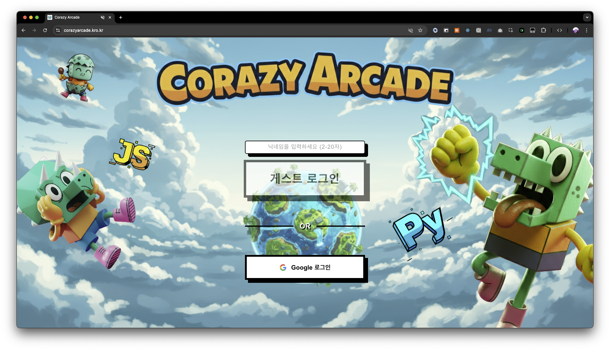

- **URL**: `https://your-domain.com`
- **설명**: 메인 로그인 화면에서 닉네임을 입력하거나 Google 로그인을 선택할 수 있습니다.
- **동작**:
  - 닉네임 입력란에 2-20자의 닉네임 입력
  - "게스트 로그인" 버튼 클릭 또는
  - "Google 로그인" 버튼 클릭

#### Step 2: 게스트 로그인 선택

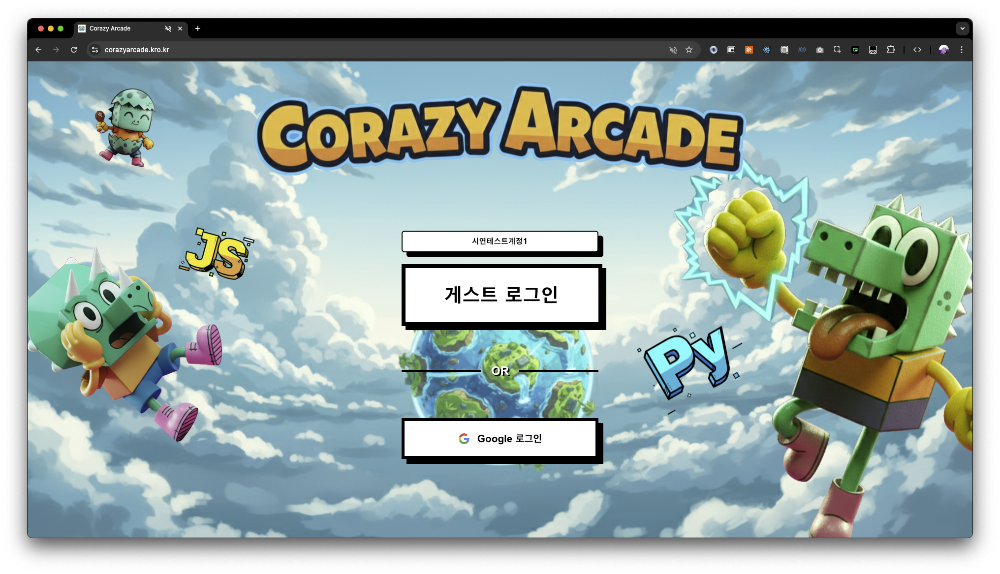

- **설명**: 닉네임을 입력한 후 게스트 로그인을 진행합니다.
- **동작**: "게스트 로그인" 버튼 클릭

#### Step 3: 메인 대기실 입장

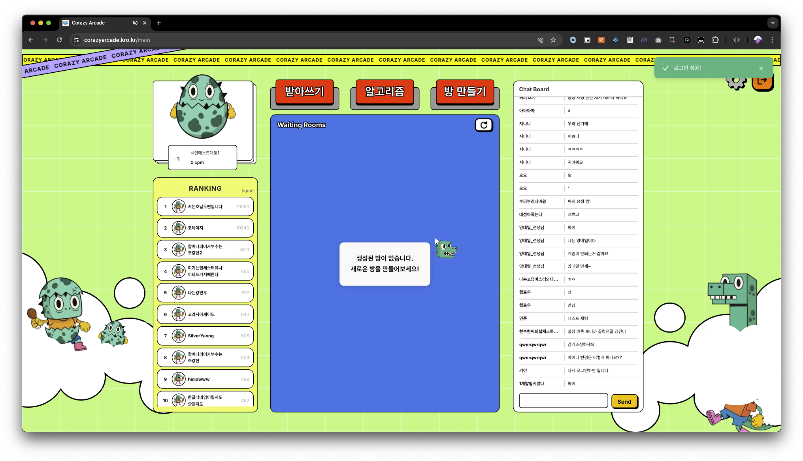

- **URL**: `https://your-domain.com/main`
- **설명**: 로그인 성공 후 메인 대기실로 이동합니다.
- **화면 구성**:
  - **좌측**: 캐릭터 프로필 및 랭킹 (CPM 기준)
  - **중앙**: 대기 중인 방 목록 (Waiting Rooms)
  - **우측**: 전체 채팅 (Chat Board)
  - **상단**: 반아쓰기, 알고리즘, 방 만들기 버튼

---

### 4.2 싱글 플레이 - 반아쓰기 모드

#### Step 4: 반아쓰기 게임 모드 선택

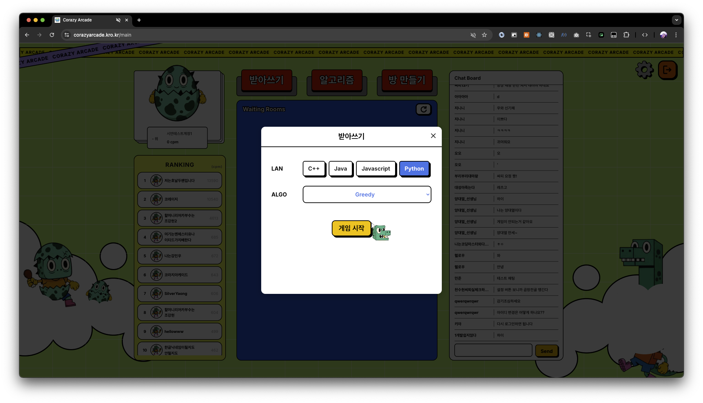

- **설명**: 반아쓰기 버튼 클릭 시 게임 설정 모달이 표시됩니다.
- **설정 항목**:
  - **LAN (프로그래밍 언어)**: C++, Java, JavaScript, Python 중 선택
  - **ALGO (알고리즘)**: Greedy, DP, Graph 등 선택
- **동작**: Python과 Greedy 알고리즘을 선택 후 "게임 시작" 버튼 클릭

#### Step 5: Greedy 알고리즘 코딩 화면

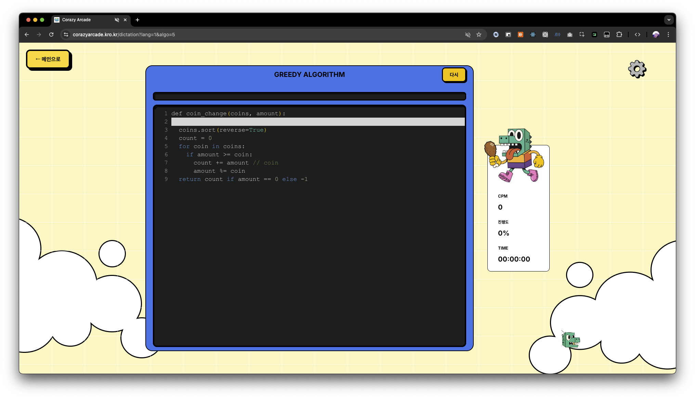

- **URL**: `https://your-domain.com/dictation?lang=1&algo=5`
- **설명**: 코드 타이핑 연습 화면입니다.
- **화면 구성**:
  - **중앙**: 코드 에디터 (완성해야 할 코드가 표시됨)
  - **우측**: 캐릭터, CPM, 진행도, 타이머 표시
  - **상단 좌측**: "← 메인으로" 버튼
- **동작**: 화면에 표시된 코드를 정확하게 타이핑

#### Step 6: 게임 완료 결과

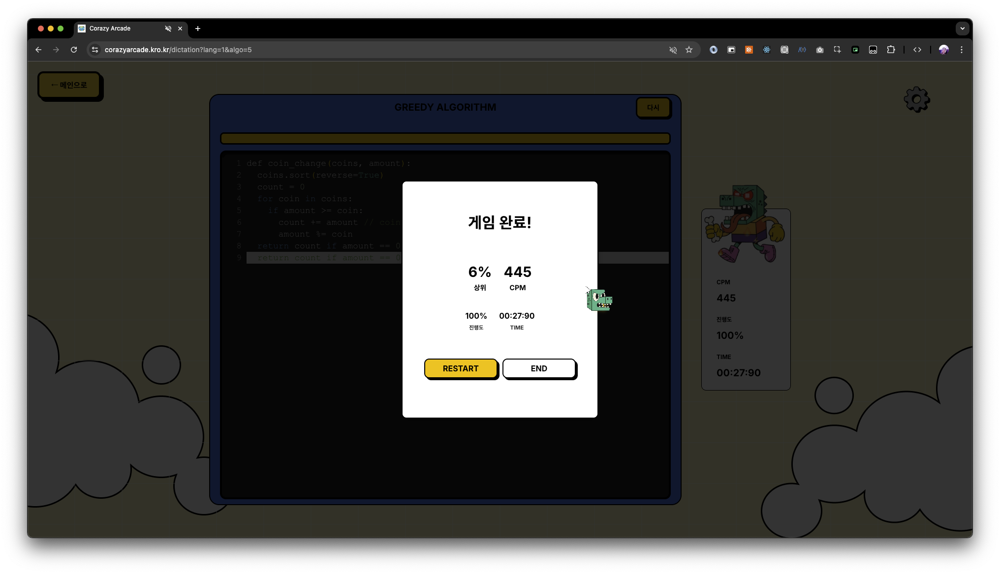

- **설명**: 코드 타이핑 완료 후 결과가 표시됩니다.
- **결과 항목**:
  - **상위 %**: 전체 사용자 중 순위 (예: 6%)
  - **CPM**: 분당 타이핑 속도 (예: 445)
  - **진행도**: 완료율 (100%)
  - **TIME**: 소요 시간 (00:27:90)
- **동작**: "RESTART" 버튼으로 재시작 또는 "END" 버튼으로 종료

---

### 4.3 멀티플레이 - 릴레이 코딩 게임

#### Step 7: 게임 방 생성 및 대기

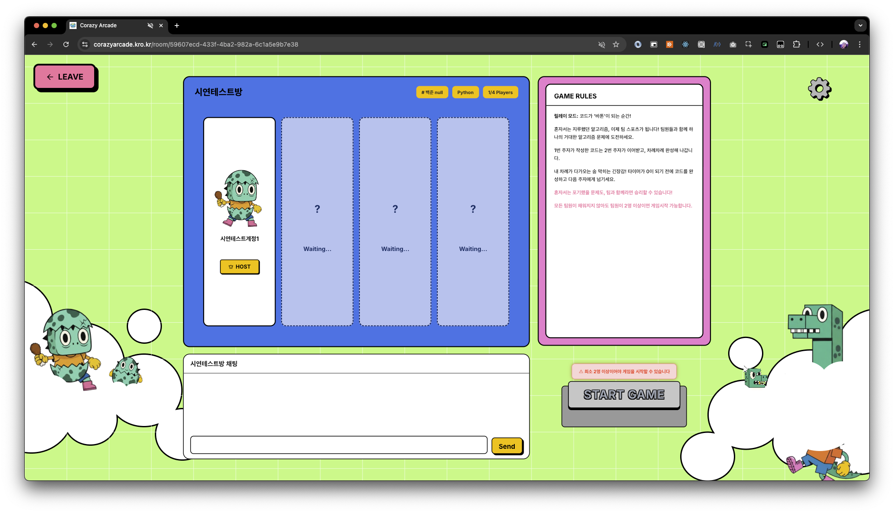

- **URL**: `https://your-domain.com/room/{room-id}`
- **설명**: 방 만들기를 통해 멀티플레이 게임 방을 생성합니다.
- **화면 구성**:
  - **좌측**: 참가자 목록 (HOST 표시)
  - **우측**: GAME RULES 설명
  - **하단**: 방 채팅
- **게임 규칙**:
  - 릴레이 모드: 코드가 '바톤'이 되는 순간!
  - 팀원들과 함께 하나의 거대한 알고리즘 문제에 도전
  - 최소 2명 이상이어야 게임 시작 가능

#### Step 8: 플레이어 입장 및 게임 시작

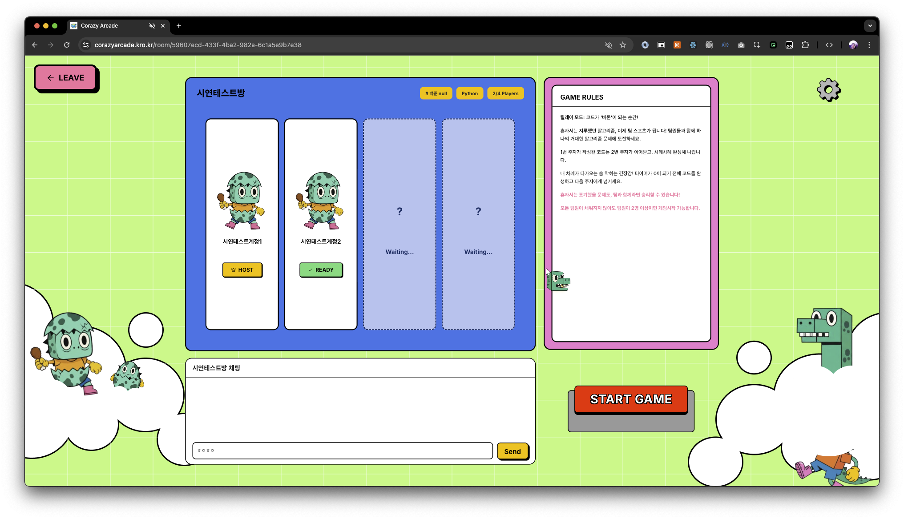

- **설명**: 2명 이상 입장 시 "START GAME" 버튼이 활성화됩니다.
- **동작**:
  - 다른 플레이어가 방에 입장하면 "READY" 상태로 표시
  - HOST가 "START GAME" 버튼 클릭하여 게임 시작

#### Step 9: 전략 회의 시간 (게임 시작 전)

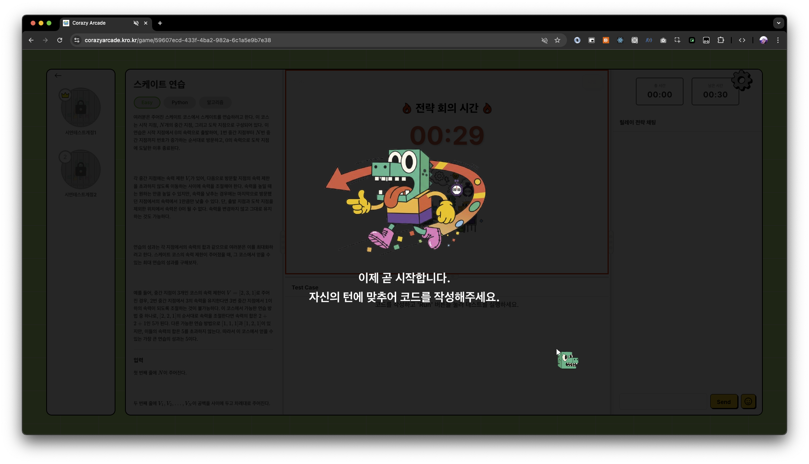

- **URL**: `https://your-domain.com/game/{room-id}`
- **설명**: 게임 시작 전 30초 동안 전략 회의 시간이 주어집니다.
- **화면 구성**:
  - **좌측**: 문제 설명 (스케이트 연습 - Easy, Python, 알고리즘)
  - **중앙**: 카운트다운 타이머 및 캐릭터 애니메이션
  - **우측**: 총 시간, 남은 시간, 릴레이 전략 채팅
- **동작**: 팀원들과 전략을 논의하고 코딩 순서 결정

#### Step 10-11: 게임 진행 중 (타이머 카운트다운)

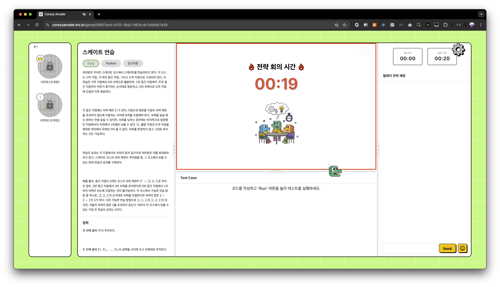

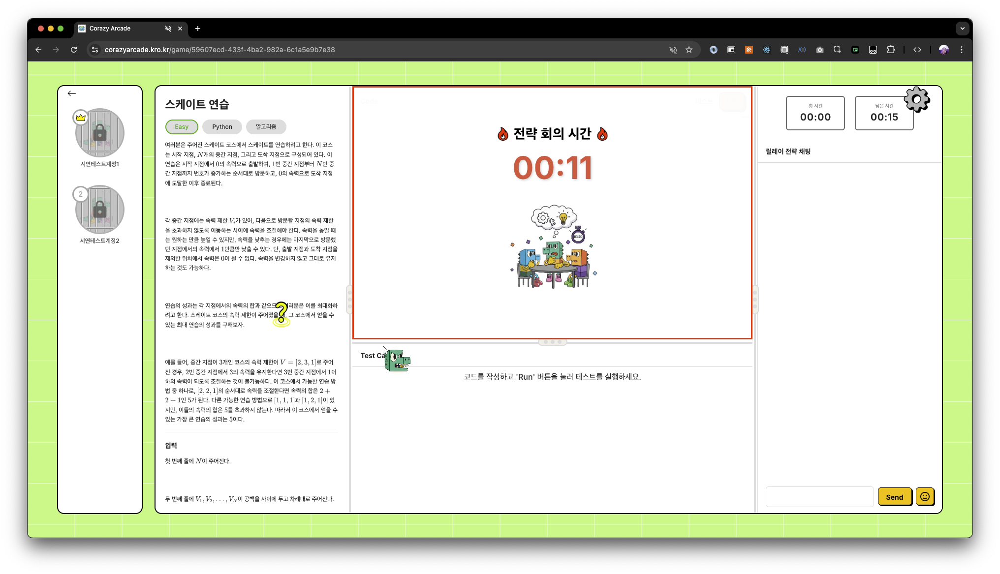

- **설명**: 전략 회의 시간이 끝나면 자동으로 게임이 시작됩니다.
- **특징**:
  - 각 플레이어에게 순서대로 코딩 턴이 배정됨
  - 자신의 턴에 맞추어 코드를 작성해야 함

#### Step 12: 코딩 화면 (테스트 케이스 확인)

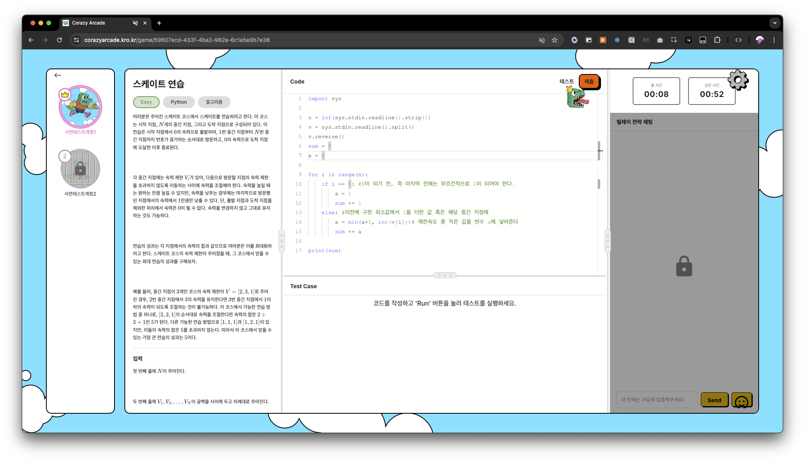

- **설명**: 자신의 턴에 코드를 작성하고 테스트 케이스를 확인합니다.
- **화면 구성**:
  - **좌측**: 문제 설명 및 입력/출력 형식
  - **중앙**: 코드 에디터 (Python 코드 작성)
  - **하단**: Test Case 결과
- **동작**: 코드 작성 후 "테스트" 버튼으로 테스트 케이스 실행

#### Step 13: 테스트 케이스 통과

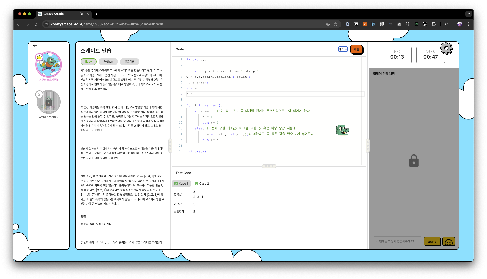

- **설명**: 테스트 케이스가 통과되면 결과가 표시됩니다.
- **결과 항목**:
  - Case 1, Case 2 등 각 테스트 케이스 통과 여부
  - 입력값, 기댓값, 실행결과 비교
- **동작**: 테스트 통과 확인 후 "제출" 버튼 클릭

#### Step 14: 채점 준비 (서버 전송)

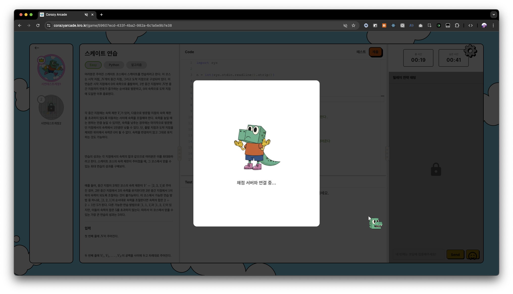

- **설명**: 코드가 채점 서버로 전송됩니다.
- **표시**: "채점 서버와 연결 중..." 메시지

#### Step 15: 채점 진행 중

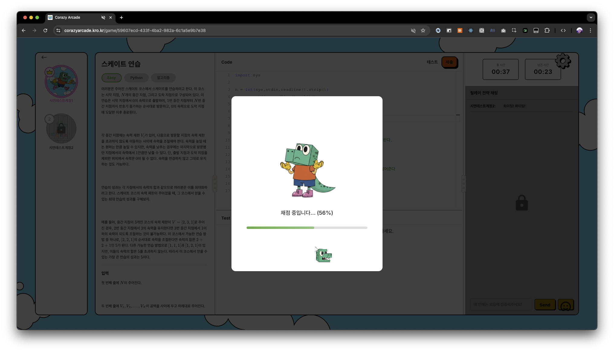

- **설명**: 서버에서 코드를 채점하고 진행률이 표시됩니다.
- **표시**: "채점 중입니다... (56%)" 진행률 바

#### Step 16: 게임 결과 확인

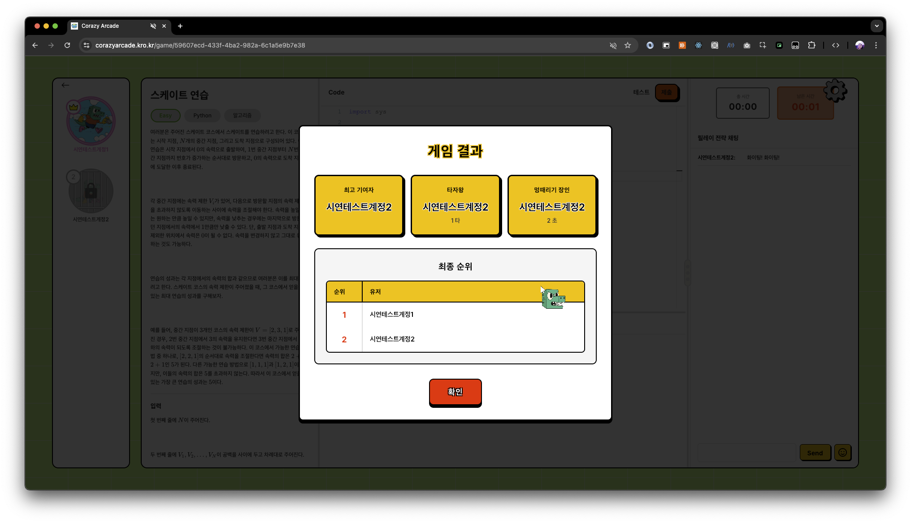

- **설명**: 모든 플레이어의 코딩이 완료되면 최종 결과가 표시됩니다.
- **결과 항목**:
  - **최고 기여자**: 가장 많은 기여를 한 플레이어
  - **타자왕**: 가장 빠른 타이핑 속도 (타수)
  - **엄페러기 장인**: 가장 빠른 시간 (초)
  - **최종 순위**: 전체 플레이어 순위
- **동작**: "확인" 버튼 클릭하여 메인 대기실로 이동

---

### 4.4 시연 체크리스트

| 순서 | 기능 | 확인 사항 |
|------|------|-----------|
| 1 | 로그인 | 게스트/Google 로그인 정상 동작 |
| 2 | 메인 대기실 | 랭킹, 채팅, 방 목록 표시 |
| 3 | 반아쓰기 | 싱글 플레이 코딩 연습 |
| 4 | 방 생성 | 멀티플레이 방 생성 및 설정 |
| 5 | 플레이어 입장 | 실시간 플레이어 입장 확인 |
| 6 | 전략 회의 | 팀 채팅 및 전략 논의 |
| 7 | 릴레이 코딩 | 순서대로 코드 작성 |
| 8 | 테스트/채점 | 테스트 케이스 및 최종 채점 |
| 9 | 결과 확인 | 순위 및 통계 표시 |

---

## 라이선스

이 프로젝트는 교육 목적으로 제작되었습니다.

## 기여자

팀 구성원
