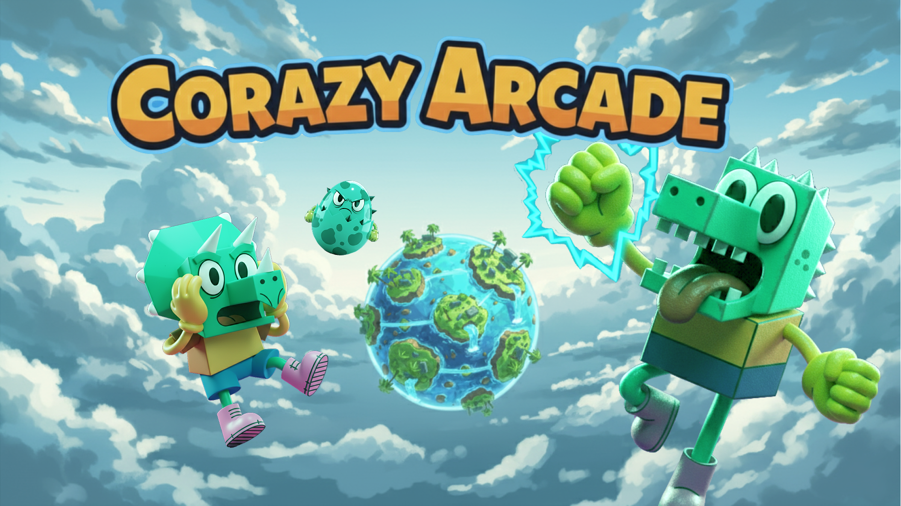

# CMM (Code Maketh Man)

알고리즘 받아쓰기와 코드배틀로 재밌게 준비하는 알고리즘 테스트

## 주요 기능

### 1. 혼자 놀기
알고리즘 코드를 직접 타이핑하며 익히는 받아쓰기 모드.
제한 시간 내에 정확한 코드를 작성하여 실력을 검증합니다.

### 2. 릴레이 코딩
팀 단위로 진행하는 실시간 대전 모드.
1명씩 릴레이 방식으로 페어프로그래밍하며 제한시간 내에 문제를 해결합니다.

### 3. 문제 풀이
알고리즘 학습 및 문제 풀이 기능.
난이도별 문제를 선택하여 자유롭게 학습할 수 있습니다.

## 기술 스택

### Frontend
- React
- Node

## 팀원

## 홍보 이미지

